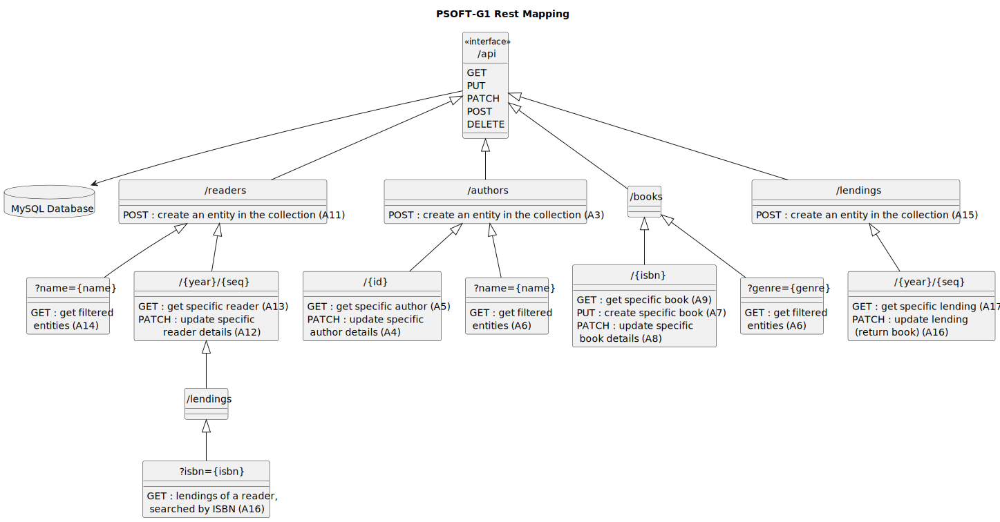

# Database – REST Mapping Design Rationale and Alternatives

This document explains the design choices for the **REST-to-database mapping** of the LMS Monolith (Phase 1).  
The diagram shows how resources and endpoints map to the underlying persistence layer.

---

## REST Mapping Diagram

### Purpose
- Capture the link between REST resources (`/books`, `/readers`, `/authors`, `/lendings`) and the database schema.
- Make explicit how HTTP verbs (GET, POST, PATCH, DELETE) map to CRUD operations in the relational model.

### Key Decisions (Justifications)
- **RESTful resource structure:** Each aggregate (Book, Reader, Author, Lending) has its own resource endpoint.
- **Clear URI hierarchy:**
    - `/readers/{id}/lendings` maps naturally to a join/query on Lending with ReaderId.
    - `/authors/{id}/books` maps to query Books with AuthorId.
- **HTTP verb semantics:**
    - `GET` → retrieve rows
    - `POST` → insert new row
    - `PATCH` → update existing row/column subset
    - `DELETE` → remove row
- **Relational DB (MySQL/H2)** chosen for Phase 1 for consistency and referential integrity.

### Alternatives Considered
- **GraphQL API:** Flexible queries, but more complex client-side schema handling.
- **Single endpoint with query parameters:** Less RESTful, weaker alignment with resources.
- **Document DB schema (e.g., MongoDB):** Faster prototyping, but weaker joins, less suited for normalized lending/reader/author relations.

### Trade-offs
- REST+RDBMS enforces structure and integrity vs. less flexibility for arbitrary queries.
- URI hierarchy slightly more verbose, but clearer semantics.

### Risks / Mitigations
- **Risk:** Overfetching large result sets.  
  **Mitigation:** Pagination parameters (`?page=X&size=Y`).
- **Risk:** API drift vs. schema drift.  
  **Mitigation:** DTOs and mappers decouple persistence from API surface.

### Verification
- Endpoint tests (MockMvc/REST-assured) validate that each HTTP verb persists or fetches correctly.
- Integration tests with MySQL/H2 confirm mappings are correct (e.g., `/readers/{id}/lendings` returns only matching lendings).

---

## Appendix: Operational Notes

- Use **DTOs** to prevent leaking entity fields directly into API responses.
- Apply **transactional boundaries** at the service layer to ensure consistency across DB operations.
- Ensure **foreign key constraints** between `Readers`, `Books`, `Authors`, and `Lendings` are enforced in schema.
- Future extension: expose reporting endpoints (e.g., `/reporting/top-books`) mapped to optimized queries or views.
