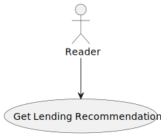
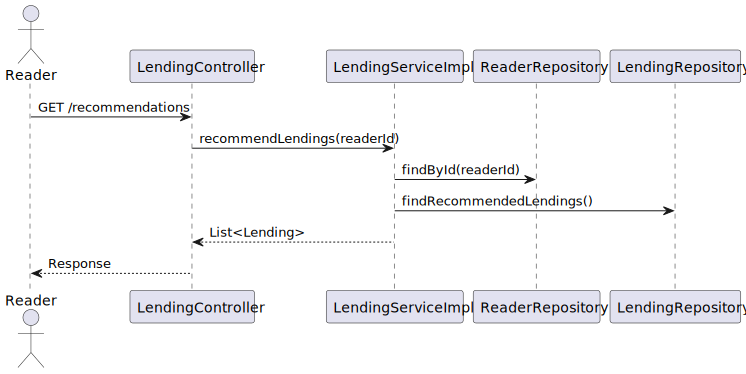
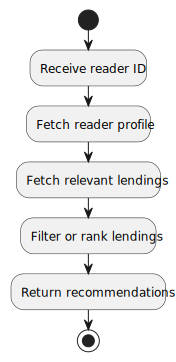
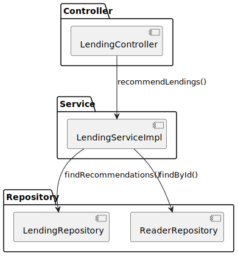

# Lending Recommendations – Design Rationale and Alternatives

This document explains the design choices for **book lending recommendations** in the LMS Monolith (Phase 1).  
The focus is on the rules for recommending books based on most-lent genres and reader age categories.

---

## 1) Use Case Diagram

### Purpose
- Capture functional goals: readers receive recommendations based on lending history and age.

### Key Decisions (Justifications)
- **Age-based recommendations:**
    - `<10 years`: recommend X books in *children* genre
    - `10–17 years`: recommend X books in *juvenile* genre
    - `18+ years`: recommend X books in the most lent genre of the reader
- **Top-X within top-Y genres:** Ensures recommendations are popular and relevant.

### Alternatives Considered
- **Generic “most popular overall” recommendations:** Simpler but less personalized.
- **Collaborative filtering (ML-based):** More accurate, but too complex for Phase 1.

### Trade-offs
- Domain-rule-based recommendations are transparent and simple vs. less adaptive than ML-based systems.

### Risks / Mitigations
- **Risk:** Hard-coded age thresholds. **Mitigation:** Make 10 and 18 configurable.
- **Risk:** Sparse data for new users. **Mitigation:** Fallback to global most popular.

### Verification
- Unit tests for each age category; integration test verifying queries for top genres.

---

## 2) Sequence Diagram

### Purpose
- Show runtime interactions for generating recommendations when a reader requests them.

### Key Decisions (Justifications)
- **Controller → Service → Repository:** Keeps business rules in service; repository handles query logic.
- **Service applies business rules (age & top genres)** before returning results.

### Alternatives Considered
- **Precomputed recommendations:** Faster retrieval but stale data.
- **Direct SQL in controller:** Faster to implement but breaks layering and testability.

### Trade-offs
- Slight latency from runtime calculation vs. always up-to-date results.

### Risks / Mitigations
- **Risk:** Inefficient queries. **Mitigation:** Proper indexing and limiting queries (TOP N).
- **Risk:** Service duplication of query logic. **Mitigation:** Use dedicated repository queries for top genres.

### Verification
- Integration test: check returned recommendations for different age groups and data distributions.

---

## 3) Activity Diagram

### Purpose
- Visualize control flow: check reader age → determine recommendation strategy → query DB → return books.

### Key Decisions (Justifications)
- **Branching by age thresholds:** Straightforward and explicit.
- **Query lending history and genres:** Ensures recommendations reflect real usage.

### Alternatives Considered
- **Single global recommendation path:** Simpler but ignores personalization.
- **External ML pipeline:** Overkill for Phase 1, better suited for later microservice architecture.

### Trade-offs
- Slightly more code paths vs. clear traceability and business alignment.

### Risks / Mitigations
- **Risk:** Wrong age data. **Mitigation:** Validation on reader profile creation/update.
- **Risk:** Empty results. **Mitigation:** Add fallbacks (e.g., global most popular).

### Verification
- Test all branches with mock readers (child, teen, adult).

---

## 4) Component Diagram

### Purpose
- Show structural components: ReaderController, RecommendationService, Repositories, Database.

### Key Decisions (Justifications)
- **Dedicated RecommendationService:** Encapsulates all business logic.
- **Separation of concerns:** Controller handles HTTP; service enforces rules; repository queries DB.

### Alternatives Considered
- **Inline recommendation logic in controller:** Simpler but harder to test/maintain.
- **Database stored procedures:** Pushes logic to DB, reducing portability and flexibility.

### Trade-offs
- Slight overhead in extra class vs. testability and clean architecture.

### Risks / Mitigations
- **Risk:** Service grows too complex. **Mitigation:** Split into sub-services or utility classes if needed.

### Verification
- Component tests for RecommendationService; repository tests with DB.

---

## 5) Class Diagram

### Purpose
- Show involved classes: `Reader`, `Lending`, `Book`, `RecommendationService`, repositories.

### Key Decisions (Justifications)
- **Domain-driven entities:** `Reader` holds age; `Lending` tracks history; `Book` is recommended.
- **Service layer** centralizes recommendation rules.

### Alternatives Considered
- **Anemic domain (all logic in service):** Easy to implement but entities become passive.
- **Rich domain (entities compute recommendations):** More OO-pure but less flexible across contexts.

### Trade-offs
- Service-centric design gives flexibility; entities stay focused on persistence and core state.

### Risks / Mitigations
- **Risk:** Entities become too passive. **Mitigation:** Add limited helper methods, keep business rules in service.

### Verification
- Unit tests for service logic; mapping tests between entities and repositories.

---

## Appendix: Operational Notes

- Threshold ages (10, 18) stored in configuration for easy tuning.
- Ensure DB queries for “most lent genre” and “top X books” are indexed.
- Consider caching recommendation results for frequent queries.
