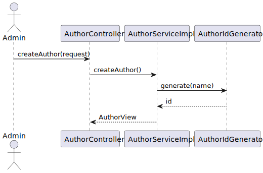
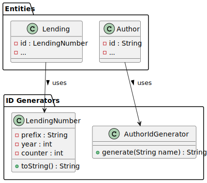

# Lendings and Author ID – Design Rationale and Alternatives

This document explains the design choices for **ID generation** in the LMS Monolith (Phase 1).  
The focus is on how **Lending IDs** and **Author IDs** are created in multiple formats as required by the functional specs.

---

## 1) Use Case Diagram

### Purpose
- Capture functional goals related to ID generation: creating IDs for lendings and authors in specific formats.

### Key Decisions (Justifications)
- **Multiple ID formats supported:**
    - 24-character hexadecimal (e.g., UUID-like for uniqueness)
    - 20-character alphanumeric hash for business identifiers
    - Integer incremental (database-independent)
- Provides flexibility for integration with external systems and reporting.

### Alternatives Considered
- **Single ID strategy (e.g., only DB auto-increment):** Simple but insufficient for business needs (e.g., external APIs require hex IDs).
- **Random IDs only:** Avoids collisions, but reduces human readability and compatibility with relational queries.

### Trade-offs
- More complexity in ID generation code vs. higher compatibility with heterogeneous system requirements.

### Risks / Mitigations
- **Risk:** Collision in generated hashes. **Mitigation:** Use proven algorithms (UUID, SHA-based hashes).
- **Risk:** Confusion over which ID to use. **Mitigation:** Clear documentation; distinct API fields for business ID vs. internal ID.

### Verification
- Unit tests verifying uniqueness, format, and mapping between entity and generated ID.

---

## 2) Sequence Diagram

### Purpose
- Show runtime flow of generating IDs when creating a new Lending or Author.

### Key Decisions (Justifications)
- **ID generator component invoked at entity creation.**
- **Repository persists the generated IDs**; services only use the DTOs.
- Supports transparent persistence regardless of which ID variant is used.

### Alternatives Considered
- **Generate IDs in the database (auto-increment only):** Easy, but doesn’t support required hex/hash formats.
- **Generate IDs on client side:** Could work, but adds inconsistency and trust issues.

### Trade-offs
- Application-level generators add CPU cost, but ensure uniform logic across services and DB vendors.

### Risks / Mitigations
- **Risk:** Incorrect format assignment. **Mitigation:** Validator to enforce regex/length rules before persisting.

### Verification
- Integration test: creating entities yields IDs in correct formats.

---

## 3) Activity Diagram

### Purpose
- Show the control flow: request → entity creation → ID generation → persistence.

### Key Decisions (Justifications)
- **Branching logic** depending on required ID format (hex, alphanumeric, integer).
- **Validation step** ensures IDs meet format requirements before save.

### Alternatives Considered
- **Always generate all types of IDs:** Increases storage and redundancy; not efficient.
- **Defer ID generation to DB triggers:** Couples logic to specific DB vendors.

### Trade-offs
- More branching in code vs. meeting business rules exactly.

### Risks / Mitigations
- **Risk:** Performance overhead when generating hashes. **Mitigation:** Use efficient libraries and cache if needed.

### Verification
- Unit test for each ID type; measure performance overhead.

---

## 4) Component Diagram

### Purpose
- Clarify how the **ID Generator component** interacts with services, repositories, and entities.

### Key Decisions (Justifications)
- **Dedicated `IdGenerator` component** → single responsibility.
- **Repositories remain agnostic** of how IDs are generated, focusing only on persistence.

### Alternatives Considered
- **Inline ID generation in entities:** Simplifies code but scatters logic.
- **External microservice for IDs:** Scales well, but overkill for Phase 1 monolith.

### Trade-offs
- Extra indirection (IdGenerator class) vs. clearer separation of concerns and testability.

### Risks / Mitigations
- **Risk:** Inconsistent usage. **Mitigation:** Centralized generator service injected where needed.

### Verification
- Component test: ID generator invoked consistently by services.

---

## 5) Class Diagram

### Purpose
- Show structure of `AuthorIdGenerator`, `LendingIdGenerator`, `Repository`, and their relation to `Author` and `Lending` entities.

### Key Decisions (Justifications)
- **Different generator classes per type**: encapsulates format logic.
- **Entities store generated IDs as attributes**; DTOs map them to API responses.

### Alternatives Considered
- **Single generic generator:** Easier to maintain, but mixes concerns and harder to extend with new formats.
- **Direct UUID in entity constructors:** Fast, but less flexible for multiple formats.

### Trade-offs
- Slightly more boilerplate vs. future flexibility.

### Risks / Mitigations
- **Risk:** Wrong generator injected. **Mitigation:** Use Spring `@Qualifier` or factory pattern.

### Verification
- Unit tests: class methods generate expected length/format.

---

## Appendix: Operational Notes

- IDs must remain **immutable** once generated.
- Document clearly which API field corresponds to which ID format (hex, business hash, incremental).
- Ensure **database constraints** (unique indexes) exist on each ID column.
