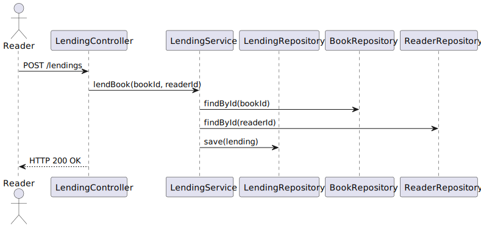
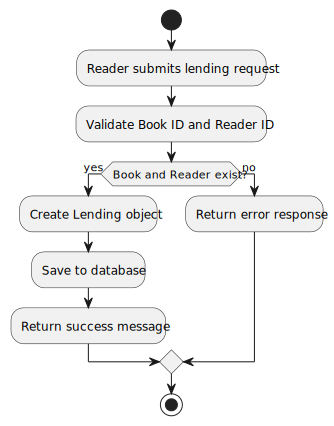
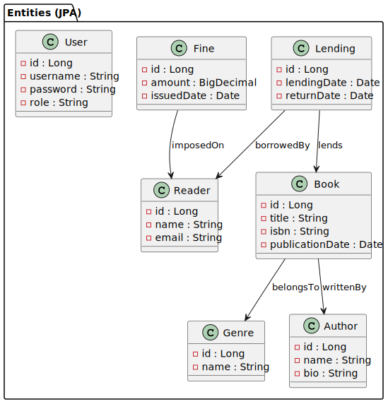

# MySQL Persistence – Design Rationale and Alternatives

This document explains the persistence design for the LMS Monolith (Phase 1) with **MySQL** as the relational store.  
Each section embeds the corresponding UML diagram and summarizes the decisions and alternatives.

> **Scope:** Lending use cases shown end‑to‑end; other aggregates (Book/Author/Reader) follow the same persistence pattern.

---

## 1) Use Case Diagram

### Purpose
- Capture functional goals that interact with persistence (create/update/read Lendings; query by reader/book; return flow, etc.).

### Key Decisions (Justifications)
- **Relational model (MySQL):** Strong consistency and relational integrity across Lending–Book–Reader.
- **API‑led access via service layer:** Controllers do not access repositories directly; all writes/reads pass through services.

### Alternatives Considered
- **Document store (e.g., MongoDB):** Flexible schema, but weaker joins; our queries are relational (FKs, constraints).
- **In‑memory only (H2):** Useful for tests, not for production reliability and durability.

### Trade‑offs
- Strict schema evolution (migrations) vs. predictable integrity and query performance.

### Risks / Mitigations
- **Risk:** Lock contention on hot tables. **Mitigation:** Proper indexing, smaller transactions, optimistic locking.
- **Risk:** Migration errors. **Mitigation:** Versioned migrations (Flyway/Liquibase) and rollback plans.

### Verification
- CRUD and query tests for Lending repository/service; integration tests using a real MySQL or Testcontainers.

---

## 2) Sequence Diagram (Lending)

### Purpose
- Show end‑to‑end interactions for a typical Lending request hitting the database via service/repository layers.

### Key Decisions (Justifications)
- **Controller → Service → Repository:** Clear layering; business rules in services; persistence hides JPA/MySQL specifics.
- **Validation before write:** Prevents invalid rows and keeps DB constraints as a backstop (not the first line of defense).

### Alternatives Considered
- **Fat controllers:** Faster to implement, but couples HTTP concerns to business logic and harms testability.
- **Direct JPA in controllers:** Reduces layers but leaks persistence to the web tier.

### Trade‑offs
- More classes and indirection vs. better separation of concerns and testability.

### Risks / Mitigations
- **Risk:** N+1 queries. **Mitigation:** Fetch joins/EntityGraphs where needed, repository query tuning.
- **Risk:** Transaction boundaries unclear. **Mitigation:** Service‑level `@Transactional` with clear read/write semantics.

### Verification
- Integration test: POST lending → persists row; PATCH return → updates status and dates; reads reflect changes.

---

## 3) Activity Diagram (Lending)

### Purpose
- Visualize control flow for creating and returning a lending, including validation and persistence points.

### Key Decisions (Justifications)
- **Pre‑checks (availability, reader status):** Fail fast before DB writes.
- **Transactional write:** Create/update within a single transaction to guarantee consistency.

### Alternatives Considered
- **Eventual consistency** via async outbox for returns: good for high scale, but unnecessary complexity in Phase 1.

### Trade‑offs
- Simpler synchronous flow vs. potential reduced peak throughput. Acceptable for Phase 1 workloads.

### Risks / Mitigations
- **Risk:** Partial failures during multi‑step updates. **Mitigation:** Single transaction; retries on transient errors.

### Verification
- Unit tests for validation branches; integration tests assert DB state after each path (success/failure).

---

## 4) Component Diagram

### Purpose
- Clarify the structural split: **Controller**, **Service**, **Repository**, **MySQL**; optional DTO/Mapper layer.

### Key Decisions (Justifications)
- **Repository pattern (Spring Data JPA):** Declarative queries, pagination, and transaction support out of the box.
- **DTO/Mapper:** Prevents leaking entities over the wire; decouples API shape from persistence schema.

### Alternatives Considered
- **Plain JDBC/Template:** Max control but more boilerplate and weaker domain focus.
- **Expose Entities:** Quicker initially but causes tight coupling and over‑exposure of columns/relations.

### Trade‑offs
- Additional mapping cost vs. API stability and security (only needed fields are exposed).

### Risks / Mitigations
- **Risk:** Overfetching/underfetching with JPA. **Mitigation:** Tailored queries, projections, and pagination.

### Verification
- Spring context test (beans wired); repository slice tests; controller tests with mock service; service tests with Testcontainers.

---

## 5) Class Diagram

### Purpose
- Show domain classes (e.g., `Lending`, `Book`, `Reader`) and how they map to the relational model (IDs, relationships).

### Key Decisions (Justifications)
- **Surrogate keys and business identifiers:** DB IDs decoupled from business IDs/format requirements of Phase 1.
- **Explicit relationships:** Foreign keys for referential integrity and efficient joins.

### Alternatives Considered
- **Natural keys:** Can simplify uniqueness, but tend to change; surrogate keys are more stable.
- **Embedded documents:** Not a fit for relational queries and ACID updates across aggregates.

### Trade‑offs
- More joins vs. data normalization and integrity.

### Risks / Mitigations
- **Risk:** Cyclic dependencies in mappings. **Mitigation:** Directional mappings, avoiding unnecessary bidirection.

### Verification
- JPA mapping tests; schema validation on boot; SQL migration tests.

---

## 6) Package Diagram

### Purpose
- Document the layering and package boundaries for persistence: `controller`, `service`, `repository`, `entity`, `dto`/`mapper`, and `configuration`.

### Key Decisions (Justifications)
- **Layered packages:** Improves modularity and test scope (slice tests).
- **`configuration` isolated:** Datasource, JPA, and transaction config live outside domain packages.

### Alternatives Considered
- **Flat package:** Less boilerplate but harder to navigate and to apply slice testing.
- **Feature‑by‑package only:** OK at scale; for Phase 1 we keep clear technical layers.

### Trade‑offs
- Slightly more structure vs. clear responsibilities and easier onboarding.

### Risks / Mitigations
- **Risk:** Cross‑layer leakage (e.g., controller using repository). **Mitigation:** Code reviews; restrict visibility; architectural tests (ArchUnit).

### Verification
- Package‑by‑layer tests (controller slice, repository slice); ensure domain code is persistence‑agnostic.

---

## Appendix: Operational Notes

- Use **indexed columns** on frequent predicates (readerId, bookId, status).
- Apply **Flyway/Liquibase** for migration history and repeatable scripts.
- Add **connection pool** tuning (HikariCP) for prod workloads.
