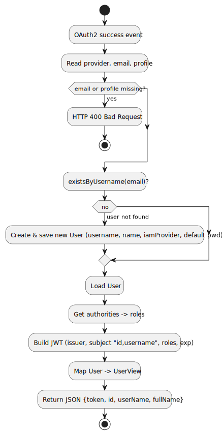

# OAuth Login Flow – Design Rationale and Alternatives

This document justifies the architectural and design decisions taken for the OAuth login flow.  
Each section embeds the corresponding UML diagram and summarizes why we chose this approach, alternatives we considered, and the trade‑offs.

> **Scope:** Phase 1 (Monolith). Providers: **GitHub / Facebook**.  
> **Outcome:** JSON response with **JWT** (no redirect) returned by a custom **OAuth success handler**.

---

## 1) Use Case Diagram

### Purpose
- Capture the user goals at a functional level: sign in via GitHub/Facebook, provision/load user and access the app.

### Key Decisions (Justifications)
- **External IAM providers (GitHub/Facebook):** Offload identity proofing and MFA to widely trusted providers; reduce password handling risk.
- **JWT issuance:** Enables stateless API calls from the client to the server; aligns with API‑led connectivity.
- **Provision/Load user on first login:** Simplifies onboarding; ensures internal user record exists for authorization/analytics.
- **Not Google:** Google did not allow our application to implement their OAuth application, therefore we implemented the GitHub OAuth application 

### Alternatives Considered
- **Local username/password** (form login): Simpler infrastructure but higher security burden and poorer UX for users already on GitHub/Facebook.
- **Opaque session tokens**: Easier to revoke but requires sticky sessions/state; worse fit for distributed scenarios and API clients.
- **Redirect‑based post‑login only:** Standard in many apps, but we prefer returning JSON to support SPAs and automation testing.

### Trade‑offs
- JWT revocation and rotation introduce operational complexity (short TTLs, refresh flows).
- Dependency on third‑party availability (GitHub/Facebook).

### Risks / Mitigations
- **Risk:** Provider outage. **Mitigation:** Allow multiple providers; add fallback local auth if required.
- **Risk:** Token misuse. **Mitigation:** Short expiration, HTTPS only, audience/issuer checks, server‑side claim validation.

### Verification
- End‑to‑end tests: login via provider → JSON response → subsequent API call with `Authorization: Bearer <JWT>`.
- Negative tests: missing attributes return HTTP 400.

---

## 2) Sequence Diagram

### Purpose
- Describe the precise runtime interactions during successful OAuth2 login and token issuance.

### Key Decisions (Justifications)
- **Custom `AuthenticationSuccessHandler`:** Returns **JSON** (token + user info) instead of default redirect — better for SPA and integration tests.
- **Validate attributes (`email`, `profile`) and error on missing data (HTTP 400):** Fail fast; avoid creating partial or anonymous records.
- **On‑the‑fly provisioning:** If the user does not exist, create it (attach `iamProvider`, default password placeholder).
- **Claims in JWT:** `issuer`, `subject = "id,username"`, `roles`, `exp=3600s` — enough for downstream authorization and session expiry.

### Alternatives Considered
- **Default Spring success handler (redirect):** Simpler, but couples server behavior to browser navigation; not ideal for API consumers.
- **User pre‑provisioning:** Avoids runtime writes, but complicates onboarding and requires a separate admin flow.
- **Long‑lived tokens:** Less churn, but larger blast radius on leakage and weaker security posture.

### Trade‑offs
- Mapping to `UserView` adds a hop but decouples API payloads from domain model (security boundary).

### Risks / Mitigations
- **Risk:** Excessive trust in client token. **Mitigation:** Validate signature, issuer, audience, and enforce role checks at resource endpoints.

### Verification
- Unit tests on handler: missing email/name → 400; correct claims in `JwtEncoder`.
- Integration test: first login creates user; second login reuses user.

---

## 3) Activity Diagram

### Purpose
- Show the control flow: success event → attribute validation → existence check → optional create → JWT → JSON response.

### Key Decisions (Justifications)
- **Fast failure on invalid identity attributes:** Avoids persisting inconsistent users.
- **Idempotent behavior:** Re‑login doesn’t recreate the user; consistent experience.

### Alternatives Considered
- **Deferred validation:** Accept partial data and fix later — leads to brittle records and harder audits.
- **Synchronous profile enrichment from provider:** Adds latency and coupling; we keep the minimum attributes needed for authN/authZ.

### Trade‑offs
- Slight overhead (existence check + optional write) on first login; acceptable for user experience.

### Risks / Mitigations
- **Risk:** Race condition on first login. **Mitigation:** Unique constraint on username/email; handle conflicts gracefully.

### Verification
- Test both branches: (a) user exists, (b) user created; assert final JSON payload.

---

## 4) Component Diagram

### Purpose
- Clarify the structural relationships between major components: Spring Security filter chain, OAuth client, custom success handler, repository, mapper, and JWT encoder; plus external providers.

### Key Decisions (Justifications)
- **API‑first with JSON success handler:** Enables browser SPA and programmatic clients to handle authentication flow uniformly.
- **`JwtEncoder` + resource server config:** Standard Spring approach; reduces custom crypto handling.
- **`UserViewMapper`:** Prevents leaking internal entity fields to public API; supports evolution of API.

### Alternatives Considered
- **Server‑side sessions instead of JWT:** Simpler revocation but poorer fit for stateless APIs and horizontal scaling.
- **No mapper (expose entity):** Faster to implement, but raises coupling and security risks.

### Trade‑offs
- More moving parts (mapper, claims, encoder) vs. clean separation of concerns and scalable API compatibility.

### Risks / Mitigations
- **Risk:** Misconfigured claims → broken downstream authZ.  
  **Mitigation:** Contract tests across handlers and resource servers.

### Verification
- Spring context test: beans are wired (`SecurityConfig` → `OAuthHandlerConfig` → `OAuthAuthenticationSuccessHandler`).
- Smoke test: call protected endpoint with JWT issued by the handler.

---

## 5) Package Diagram

### Purpose
- Document the package boundaries and dependencies: configuration, user management (model, api, repositories), and security/jwt.

### Key Decisions (Justifications)
- **`UserRepository` in `…usermanagement.repositories`:** Reflects domain ownership and avoids polluting configuration packages.
- **Configuration packages contain only wiring (`SecurityConfig`, `OAuthHandlerConfig`, handler class).**

### Alternatives Considered
- **Putting repositories in configuration:** Convenient but conflates concerns and hinders reuse/testing.
- **Flattened package structure:** Fewer packages, but weaker modularity and clarity.

### Trade‑offs
- Slightly more boilerplate imports vs. clearer ownership and maintainability.

### Risks / Mitigations
- **Risk:** Cross‑package leaks (e.g., exposing entities via API).  
  **Mitigation:** Maintain strict API DTOs + mapper.

### Verification
- Package‑private visibility where possible; compile‑time checks ensure correct dependencies.

---

## Appendix: Operational Notes

- If the custom success handler is **not** registered with  
  `oauth2Login(o -> o.successHandler(oAuthAuthenticationSuccessHandler))`,  
  Spring will **redirect** on success. The sequence/component diagrams assume the **JSON approach**; use a redirect variant if you keep the default.
- JWT TTLs and rotation strategies should be reviewed before production; consider refresh tokens or short TTL + re‑auth.

