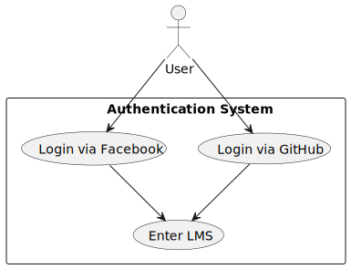
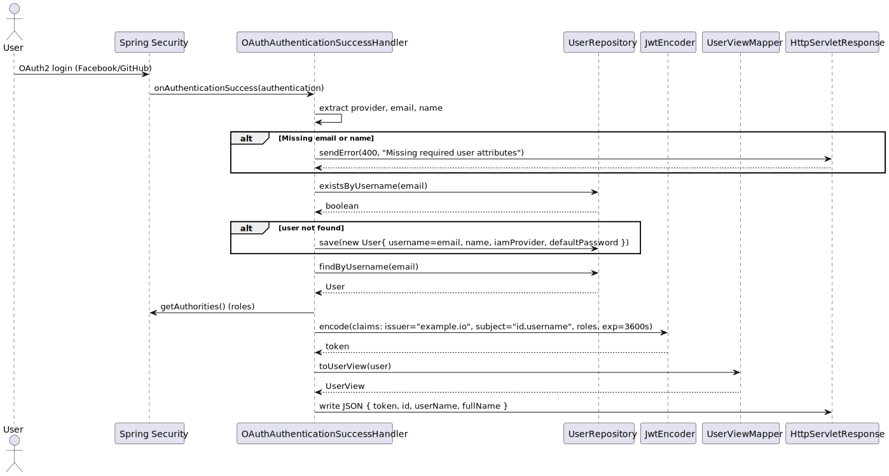
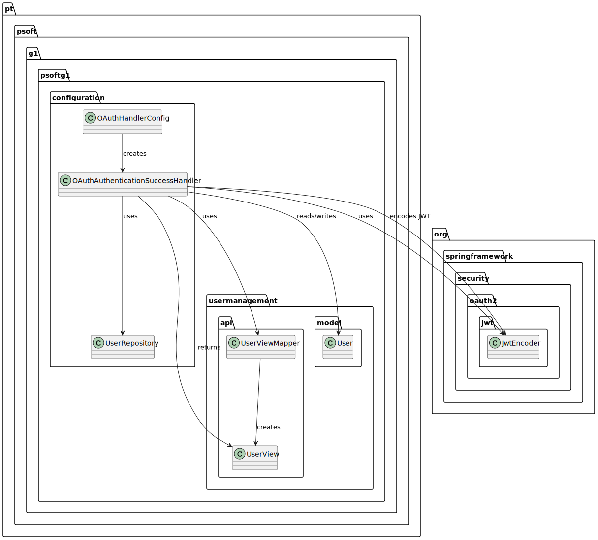

# Phase 1
## Implemented Requirements
Since we are with only 2 students, we decided to implement around 2/3 of the requirements. Here is a list of the implemented requirements:
1. Persisting data in different data models (e.g. relational, document) and SGBD:
    - Relational data model: e.g. H2, MySQL, SQL Server
   
2. Adopting different IAM (Identity and Access Management) providers:
    - Google
    - Facebook
   
3. Generating Lending and Authors ID in different formats according to the following specifications:
    - 24 hexadecimal characters
    - 20 alphanumeric characters as business entity business id hash
    - Integer incremental (NB: it should be independent from the Ids of the database)
   
4. Recommending Lendings according to following specifications:
    - X books most lent from the Y most lent genre
    - Based on the age of the reader:
      - age<10: X books of genre “children”
      - 10=<age<18: X books of genre “juvenile”
      - 18=<age: X books of the most lent genre of the reader
      - NB: preferably, 10 and 18 would be configurable.

## Kanban board
| Not addressed                                                                          | Work-in-progress | Addressed         | Tested | Completed                                                        |
|----------------------------------------------------------------------------------------|------------------|-------------------|--------|------------------------------------------------------------------|
|                                                                                        |                  |                   |        | Design UML diagrams for the MySQL server implementation          |
| Design UML diagrams for the MongoDB implementation                                     |                  |                   |        |                                                                  |
|                                                                                        |                  |                   |        | Design UML diagrams for the IAM (Identity and Access Management) |
| Design UML diagrams for the Lending and Authors ID                                     |                  |                   |        |                                                                  |
| Design UML diagrams for recommending lendings                                          |                  |                   |        |                                                                  |
|                                                                                        |                  |                   |        | MySQL server setup                                               |
|                                                                                        |                  |                   |        | MySQL DB implementation                                          |
| Mongo DB setup                                                                         |                  |                   |        |                                                                  |
| Mongo DB implementation                                                                |                  |                   |        |                                                                  |
|                                                                                        |                  | Google IAM        |        |                                                                  |
|                                                                                        |                  | Facebook IAM      |        |                                                                  |
|                                                                                        |                  | Frontend login UI |        |                                                                  |
| Lending and Authors ID: 24 hexadecimal characters                                      |                  |                   |        |                                                                  |
| Lending and Authors ID: 20 alphanumeric characters as business entity business id hash |                  |                   |        |                                                                  |
| Integer Incremental                                                                    |                  |                   |        |                                                                  |
| Recommending Lendings: X books most lent from the Y most lent genre                    |                  |                   |        |                                                                  |
| Recommending Lendings: age<10: X books of genre “children”                             |                  |                   |        |                                                                  |
| Recommending Lendings: 10=<age<18: X books of genre “juvenile”                         |                  |                   |        |                                                                  |
| Recommending Lendings: 18=<age: X books of the most lent genre of the reader           |                  |                   |        |                                                                  |
| Recommending Lendings: NB: preferably, 10 and 18 would be configurable.                |                  |                   |        |                                                                  |
|                                                                                        | Write report     |                   |        |                                                                  |

---------------------------------------------------------------

# Attribute-Driven Design (ADD)

## 1. Project Context
This document describes the architectural design of Phase 1 of the Library Management System backend. The system is built as a RESTful Spring Boot application, offering endpoints for:

- Books
- Genres
- Authors
- Readers
- Lendings

This phase focuses on incorporating software quality attributes missing in previous versions: **extensibility**, **configurability**, and **reliability**. The system is designed to run locally with a simple frontend login page and backend service logic.

---------------------------------------------------------------

## 2. Stakeholders and Concerns

| Stakeholder     | Concern                                                |
|-----------------|---------------------------------------------------------|
| End users       | Functional login and lending features                   |
| Developers      | A modular and configurable architecture                 |
| Project Evaluators | Verifiable quality through code, diagrams, and tests   |

---------------------------------------------------------------

## 3. Quality Attributes (QAs)
The following quality attributes have guided the architecture of Phase 1:

### 3.1 Extensibility
- Add new ID formats or IAM providers with minimal code changes

### 3.2 Configurability
- Select ID generation or lending strategy at runtime/config level

### 3.3 Reliability
- Ensure secure login, consistent ID generation, and predictable lending recommendations
- Support through unit, integration, and mutation tests

---------------------------------------------------------------

## 4. Implemented Requirements (ASRs)

| Requirement                                            | QA Focus                       |
|--------------------------------------------------------|--------------------------------|
| Store data using relational models (e.g., MySQL, H2)   | Configurability                |
| Authenticate using Google and Facebook SAML providers  | Extensibility, Reliability     |
| Generate Lending and Author IDs using 3 formats        | Configurability                |
| Recommend lendings based on reader age and genre stats | Configurability, Extensibility |

---------------------------------------------------------------

## 5. Architectural Decisions

### 5.1 Persistence Layer
- Use Spring Data JPA to abstract persistence logic
- Relational DBs supported: H2 (in-memory) and MySQL
- Future extension: document/NoSQL databases (MongoDB) (not implemented)

### 5.2 IAM Provider Integration
- Configure Google and Facebook login using Spring Security + OAuth2
- Modular setup allows new providers to be added without rewriting auth logic, like GitHub, Azure, etc

### 5.3 ID Generation Strategy
- Strategy pattern implemented to support:
    - 24-character hex string
    - 20-character alphanumeric hash
    - Incremental integer ID (independent of database)
- Configurable via service injection and/or external configuration

### 5.4 Lending Recommendation Logic
- Based on:
    - Most-lent books in most-lent genre
    - Reader age group:
        - `<10`: “children”
        - `10–17`: “juvenile”
        - `18+`: reader’s favorite genre
- Age thresholds are configurable via the application.properties file

---------------------------------------------------------------

## 6. Tactics and Patterns
| Tactic / Pattern           | Application Area                                      |
|----------------------------|-------------------------------------------------------|
| Strategy Pattern           | ID generation, lending recommendations                |
| Dependency Injection       | Services, strategy selection                          |
| Externalized Configuration | Age thresholds, DB settings                           |
| OAuth2 + Spring Security   | SAML provider integration (Google, Facebook)          |
| Modularity by Package      | `auth`, `persistence`, `idgeneration`, `lending`      |

---------------------------------------------------------------

## 7. Architectural Views (UML Diagrams)
UML diagrams are provided to visualize the major architectural decisions and flows. The diagrams are located in `Phase_1/assets`, grouped by requirement.

Diagram types include:
- Use Case
- Activity
- Component
- Sequence
- Class

Each corresponds to one of the four implemented requirements.

---------------------------------------------------------------

## 8. Limitations
- Only relational DBs (MySQL, H2) supported for now
- No admin UI or external config dashboard
- Runs locally only (no Docker/Kubernetes deployment yet, part of phase 2)
- Azure IAM not implemented in Phase 1

---------------------------------------------------------------

## 9. Next Steps
- Add support for document/NoSQL databases (MongoDB)
- Integrate Azure IAM provider
- Implement runtime config switching
- Add cloud deployment support (Docker, CI/CD)

---------------------------------------------------------------

# 4+1 model 
The diagrams that were made with for the 4+1 model. 

| View        | UML diagram        |
|-------------|--------------------|
| Logical     | Class, Component   |
| Process     | Activity           |
| Physical    | Deployment         |
| Development | Component, Package |
| Scenarios   | Use Case, Sequence |

---------------------------------------------------------------

## OAuth Login Flow 
### Scenarios: Use Case Diagram

### Scenarios: Sequence Diagram

### Process: Activity Diagram

### Logical: Component Diagram

### Development: Package Diagram

---------------------------------------------------------------